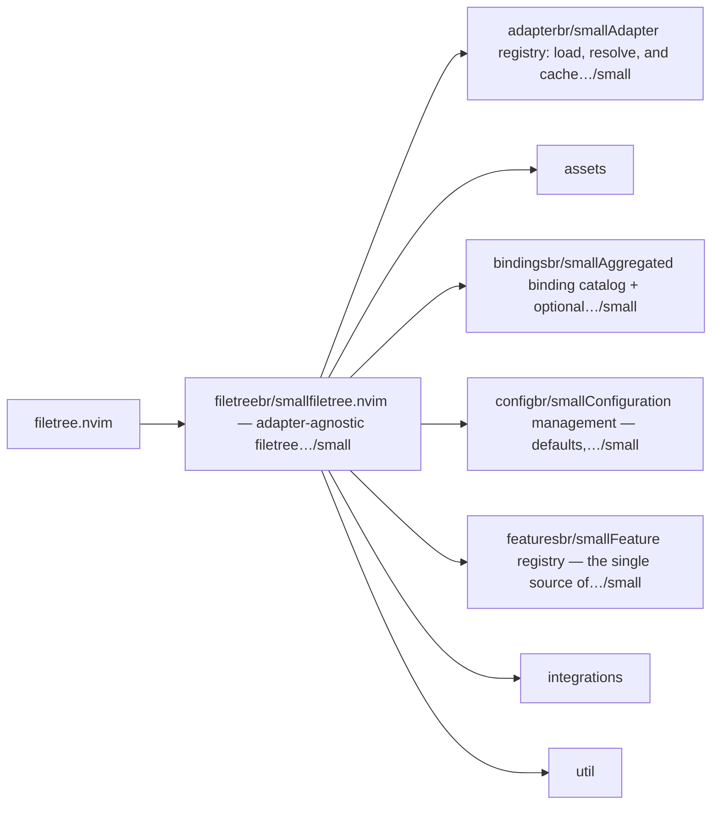
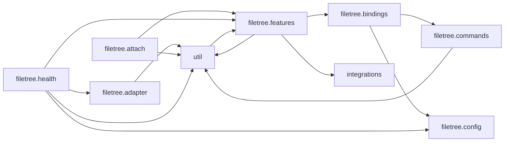

# filetree.nvim — module map

> **Generated** by `documentation`. Do not edit by hand — run `:DocMap`
> (or `nvim --headless -l scripts/gen_map.lua`) to regenerate.

**60 modules** · 16 namespaces · 45 helper files

The [interactive map](index.html) has filtering, full descriptions and
source links; this page is the version the code host renders directly.

## Namespaces

## Dependencies

Which parts of the tree require which, rolled up to the second level.
The [interactive map](index.html)'s **Deps** view has this per module,
in both directions, with load-time and lazy requires told apart.

## Modules

| Module | Description | Fns | Docs |
|---|---|---|---|
| `filetree` | filetree.nvim — adapter-agnostic filetree features for Neovim. | 8 | [src](../../lua/filetree/init.lua) |
| &nbsp;&nbsp;`filetree.adapter` | Adapter registry: load, resolve, and cache the active filetree adapter. | 4 | [src](../../lua/filetree/adapter/init.lua) |
| &nbsp;&nbsp;`assets` |  |  |  |
| &nbsp;&nbsp;&nbsp;&nbsp;`templates` |  |  |  |
| &nbsp;&nbsp;`filetree.bindings` | Aggregated binding catalog + optional which-key integration. | 3 | [src](../../lua/filetree/bindings/init.lua) |
| &nbsp;&nbsp;`filetree.config` | Configuration management — defaults, merging, validation. | 8 | [src](../../lua/filetree/config/init.lua) |
| &nbsp;&nbsp;`filetree.features` | Feature registry — the single source of truth mapping feature names to their module paths and categories. | 4 | [src](../../lua/filetree/features/init.lua) |
| &nbsp;&nbsp;&nbsp;&nbsp;`compare` |  |  |  |
| &nbsp;&nbsp;&nbsp;&nbsp;&nbsp;&nbsp;`filetree.features.compare.diff` | Side-by-side file diff triggered from the tree. | 10 | [src](../../lua/filetree/features/compare/diff/init.lua) |
| &nbsp;&nbsp;&nbsp;&nbsp;`fileops` |  |  |  |
| &nbsp;&nbsp;&nbsp;&nbsp;&nbsp;&nbsp;`filetree.features.fileops.buffer_save` | Force-save a buffer without leaving the tree window. | 5 | [src](../../lua/filetree/features/fileops/buffer_save/init.lua) |
| &nbsp;&nbsp;&nbsp;&nbsp;&nbsp;&nbsp;`filetree.features.fileops.copy_move` | Filesystem clipboard: stage files for copy or cut, then paste. | 16 | [src](../../lua/filetree/features/fileops/copy_move/init.lua) |
| &nbsp;&nbsp;&nbsp;&nbsp;&nbsp;&nbsp;`filetree.features.fileops.create_from_template` | Create files from user-defined templates with variable substitution. | 25 | [src](../../lua/filetree/features/fileops/create_from_template/init.lua) |
| &nbsp;&nbsp;&nbsp;&nbsp;&nbsp;&nbsp;`filetree.features.fileops.open_replace` | Open file under cursor and replace the current editor buffer. | 3 | [src](../../lua/filetree/features/fileops/open_replace/init.lua) |
| &nbsp;&nbsp;&nbsp;&nbsp;&nbsp;&nbsp;`filetree.features.fileops.open_variants` | Alternate ways to open the current node besides the adapter's default <CR>. | 8 | [src](../../lua/filetree/features/fileops/open_variants/init.lua) |
| &nbsp;&nbsp;&nbsp;&nbsp;&nbsp;&nbsp;`filetree.features.fileops.rename_batch` | Batch-rename visible tree nodes in a scratch buffer. | 7 | [src](../../lua/filetree/features/fileops/rename_batch/init.lua) |
| &nbsp;&nbsp;&nbsp;&nbsp;&nbsp;&nbsp;`filetree.features.fileops.smart_create` | Enhanced file/directory creation with clipboard paste and LuaLS templates. | 10 | [src](../../lua/filetree/features/fileops/smart_create/init.lua) |
| &nbsp;&nbsp;&nbsp;&nbsp;&nbsp;&nbsp;`filetree.features.fileops.smart_rename` | LSP-aware single-node rename with will/did rename notifications. | 20 | [src](../../lua/filetree/features/fileops/smart_rename/init.lua) |
| &nbsp;&nbsp;&nbsp;&nbsp;&nbsp;&nbsp;`filetree.features.trash` | Moves the node's file/directory to the system trash (platform-specific) and records it for later restoration. | 18 | [src](../../lua/filetree/features/fileops/trash/init.lua) |
| &nbsp;&nbsp;&nbsp;&nbsp;`git` |  |  |  |
| &nbsp;&nbsp;&nbsp;&nbsp;&nbsp;&nbsp;`filetree.features.git_status` | Runs `git status --porcelain` in the nearest project root and maps each changed path to its status code. | 7 | [src](../../lua/filetree/features/git/git_status/init.lua) |
| &nbsp;&nbsp;&nbsp;&nbsp;`infra` |  |  |  |
| &nbsp;&nbsp;&nbsp;&nbsp;&nbsp;&nbsp;`filetree.features.file_watcher` | Uses vim.uv.fs_event (libuv) to watch the tree root directory. | 12 | [src](../../lua/filetree/features/infra/file_watcher/init.lua) |
| &nbsp;&nbsp;&nbsp;&nbsp;&nbsp;&nbsp;`filetree.features.handle_guard` | Thin wiring around `lib.nvim.neotree.watch`. | 6 | [src](../../lua/filetree/features/infra/handle_guard/init.lua) |
| &nbsp;&nbsp;&nbsp;&nbsp;&nbsp;&nbsp;`filetree.features.hooks_api` | Provides a simple observable event emitter that other features and third-party plugins can use to react to filetree lifecycle events. | 9 | [src](../../lua/filetree/features/infra/hooks_api/init.lua) |
| &nbsp;&nbsp;&nbsp;&nbsp;&nbsp;&nbsp;`filetree.features.ignore_list` | Injects a list of basenames into the adapter's native hide mechanism so they do not appear in the tree at all. | 8 | [src](../../lua/filetree/features/infra/ignore_list/init.lua) |
| &nbsp;&nbsp;&nbsp;&nbsp;&nbsp;&nbsp;`filetree.features.project_root` | Walks up the directory tree from a given path looking for root markers. | 7 | [src](../../lua/filetree/features/infra/project_root/init.lua) |
| &nbsp;&nbsp;&nbsp;&nbsp;&nbsp;&nbsp;`filetree.features.safety` | Exposes M.before_delete(path) and M.before_move(src, dst) which other code calls before destructive operations. | 6 | [src](../../lua/filetree/features/infra/safety/init.lua) |
| &nbsp;&nbsp;&nbsp;&nbsp;&nbsp;&nbsp;`filetree.features.watcher_quarantine` | On Windows, libuv file watchers sometimes emit EPERM errors when a file or directory is deleted or moved while the watcher is active. | 14 | [src](../../lua/filetree/features/infra/watcher_quarantine/init.lua) |
| &nbsp;&nbsp;&nbsp;&nbsp;`lsp` |  |  |  |
| &nbsp;&nbsp;&nbsp;&nbsp;&nbsp;&nbsp;`filetree.features.lsp.lsp_diagnostics` | Decorate tree nodes with LSP diagnostic counts via extmarks. | 7 | [src](../../lua/filetree/features/lsp/lsp_diagnostics/init.lua) |
| &nbsp;&nbsp;&nbsp;&nbsp;`nav` |  |  |  |
| &nbsp;&nbsp;&nbsp;&nbsp;&nbsp;&nbsp;`filetree.features.nav.auto_resize` | Responsive tree sidebar width based on editor column count. | 8 | [src](../../lua/filetree/features/nav/auto_resize/init.lua) |
| &nbsp;&nbsp;&nbsp;&nbsp;&nbsp;&nbsp;`filetree.features.nav.auto_reveal` | Automatically reveal the current editor buffer in the tree. | 13 | [src](../../lua/filetree/features/nav/auto_reveal/init.lua) |
| &nbsp;&nbsp;&nbsp;&nbsp;&nbsp;&nbsp;`filetree.features.nav.buffer_cycle` | Cycle the adjacent editor buffer without leaving the tree window. | 5 | [src](../../lua/filetree/features/nav/buffer_cycle/init.lua) |
| &nbsp;&nbsp;&nbsp;&nbsp;&nbsp;&nbsp;`filetree.features.nav.cwd_mode` | Root policy: decide *where* the cwd and the tree root belong. | 34 | [src](../../lua/filetree/features/nav/cwd_mode/init.lua) |
| &nbsp;&nbsp;&nbsp;&nbsp;&nbsp;&nbsp;`filetree.features.nav.cwd_sync` | Keep Neovim's cwd (and the tree root) in sync with the current buffer. | 11 | [src](../../lua/filetree/features/nav/cwd_sync/init.lua) |
| &nbsp;&nbsp;&nbsp;&nbsp;&nbsp;&nbsp;`filetree.features.nav.layout_guard` | Ensure an editor window always exists when the tree is the only window. | 3 | [src](../../lua/filetree/features/nav/layout_guard/init.lua) |
| &nbsp;&nbsp;&nbsp;&nbsp;&nbsp;&nbsp;`filetree.features.nav.no_name_guard` | Neovim shows a scratch [No Name] buffer in a window whenever that window has no buffer to display (a `:bd`/`:bwipeout` with no alternate, `:enew`, or cycling… | 5 | [src](../../lua/filetree/features/nav/no_name_guard/init.lua) |
| &nbsp;&nbsp;&nbsp;&nbsp;&nbsp;&nbsp;`filetree.features.reveal_alt` | Binds a key (default `B`) in the tree buffer. | 2 | [src](../../lua/filetree/features/nav/reveal_alt/init.lua) |
| &nbsp;&nbsp;&nbsp;&nbsp;&nbsp;&nbsp;`filetree.features.tree_traverse` | Navigate up/down the directory tree with optional CWD sync. | 5 | [src](../../lua/filetree/features/nav/tree_traverse/init.lua) |
| &nbsp;&nbsp;&nbsp;&nbsp;`org` |  |  |  |
| &nbsp;&nbsp;&nbsp;&nbsp;&nbsp;&nbsp;`filetree.features.marks` | Marks are stored per-session as a set of absolute paths. | 13 | [src](../../lua/filetree/features/org/marks/init.lua) |
| &nbsp;&nbsp;&nbsp;&nbsp;&nbsp;&nbsp;`filetree.features.session` | Persists per-project tree state to JSON: - adapter name - tree root directory - scroll position (topline) - cursor line - a list of expanded directory paths… | 10 | [src](../../lua/filetree/features/org/session/init.lua) |
| &nbsp;&nbsp;&nbsp;&nbsp;`paths` |  |  |  |
| &nbsp;&nbsp;&nbsp;&nbsp;&nbsp;&nbsp;`filetree.features.copy_file_list` | Copy recursive file/directory lists of the current node to clipboard. | 10 | [src](../../lua/filetree/features/paths/copy_file_list/init.lua) |
| &nbsp;&nbsp;&nbsp;&nbsp;&nbsp;&nbsp;`filetree.features.lua_require_copy` | Copy current node as require('module.path') string(s) to clipboard. | 8 | [src](../../lua/filetree/features/paths/lua_require_copy/init.lua) |
| &nbsp;&nbsp;&nbsp;&nbsp;&nbsp;&nbsp;`filetree.features.markdown_links` | Every generated line is `[name](relative/path)`, joined with newlines and written to both the "+" (system) and unnamed '"' registers, matching the… | 8 | [src](../../lua/filetree/features/paths/markdown_links/init.lua) |
| &nbsp;&nbsp;&nbsp;&nbsp;&nbsp;&nbsp;`filetree.features.path_copy` | Provides quick access to multiple path representations, all written to both the "+" (system) register and the unnamed '"' register. | 8 | [src](../../lua/filetree/features/paths/path_copy/init.lua) |
| &nbsp;&nbsp;&nbsp;&nbsp;`search` |  |  |  |
| &nbsp;&nbsp;&nbsp;&nbsp;&nbsp;&nbsp;`filetree.features.search.filter` | Live filter/search within the tree using a floating input. | 8 | [src](../../lua/filetree/features/search/filter/init.lua) |
| &nbsp;&nbsp;&nbsp;&nbsp;&nbsp;&nbsp;`filetree.features.search.find_files` | Fuzzy-find files within the tree root, then reveal the result. | 12 | [src](../../lua/filetree/features/search/find_files/init.lua) |
| &nbsp;&nbsp;&nbsp;&nbsp;&nbsp;&nbsp;`filetree.features.search.grep_in_dir` | Grep/ripgrep in the directory of the current tree node. | 11 | [src](../../lua/filetree/features/search/grep_in_dir/init.lua) |
| &nbsp;&nbsp;&nbsp;&nbsp;&nbsp;&nbsp;`filetree.features.search.live_search` | Real-time incremental search/filter inside the tree buffer. | 7 | [src](../../lua/filetree/features/search/live_search/init.lua) |
| &nbsp;&nbsp;&nbsp;&nbsp;`system` |  |  |  |
| &nbsp;&nbsp;&nbsp;&nbsp;&nbsp;&nbsp;`filetree.features.system.open_in_fm` | Open the node under cursor in the system file manager. | 5 | [src](../../lua/filetree/features/system/open_in_fm/init.lua) |
| &nbsp;&nbsp;&nbsp;&nbsp;&nbsp;&nbsp;`filetree.features.system.open_with` | Open tree nodes with external applications. | 9 | [src](../../lua/filetree/features/system/open_with/init.lua) |
| &nbsp;&nbsp;&nbsp;&nbsp;&nbsp;&nbsp;`filetree.features.system.pdf_create` | The write-direction counterpart to pdf_open: turns image/markdown/text/ html/office file(s) under the cursor into PDF(s). | 8 | [src](../../lua/filetree/features/system/pdf_create/init.lua) |
| &nbsp;&nbsp;&nbsp;&nbsp;&nbsp;&nbsp;`filetree.features.system.pdf_open` | Open the PDF under the cursor via pdfport.nvim (optional dependency). | 8 | [src](../../lua/filetree/features/system/pdf_open/init.lua) |
| &nbsp;&nbsp;&nbsp;&nbsp;&nbsp;&nbsp;`filetree.features.shell_run` | Binds a key (default `i`) in the tree buffer. | 5 | [src](../../lua/filetree/features/system/shell_run/init.lua) |
| &nbsp;&nbsp;&nbsp;&nbsp;`ui` |  |  |  |
| &nbsp;&nbsp;&nbsp;&nbsp;&nbsp;&nbsp;`filetree.features.breadcrumbs` | Three display modes (configurable): "winbar" Set &winbar of the editor window (requires Neovim 0.8+) "float" Small 1-line floating window anchored to the tree… | 8 | [src](../../lua/filetree/features/ui/breadcrumbs/init.lua) |
| &nbsp;&nbsp;&nbsp;&nbsp;&nbsp;&nbsp;`filetree.features.cheatsheet` | active tree-scoped filetree.nvim keymap, grouped by category. | 6 | [src](../../lua/filetree/features/ui/cheatsheet/init.lua) |
| &nbsp;&nbsp;&nbsp;&nbsp;&nbsp;&nbsp;`filetree.features.context_menu` | Binds a mouse trigger (default `<RightMouse>`) inside the tree buffer. | 4 | [src](../../lua/filetree/features/ui/context_menu/init.lua) |
| &nbsp;&nbsp;&nbsp;&nbsp;&nbsp;&nbsp;`filetree.features.current_hl` | On BufEnter/WinEnter events (debounced), the current file's line and its parent directory's line are highlighted in the tree buffer using extmarks. | 7 | [src](../../lua/filetree/features/ui/current_hl/init.lua) |
| &nbsp;&nbsp;&nbsp;&nbsp;&nbsp;&nbsp;`filetree.features.cursor_hide` | Creates a window-local highlight override (winhighlight) so the cursor disappears when focus is inside a tree buffer, and reappears on leave. | 3 | [src](../../lua/filetree/features/ui/cursor_hide/init.lua) |
| &nbsp;&nbsp;&nbsp;&nbsp;&nbsp;&nbsp;`filetree.features.node_info` | Toggleable hover window showing filesystem metadata for the current tree node. | 9 | [src](../../lua/filetree/features/ui/node_info/init.lua) |
| &nbsp;&nbsp;&nbsp;&nbsp;&nbsp;&nbsp;`filetree.features.opened_sync` | Tree plugins that colour the nodes of currently-open files (neo-tree's `name.highlight_opened_files`, for instance) only re-evaluate that decoration when they… | 4 | [src](../../lua/filetree/features/ui/opened_sync/init.lua) |
| &nbsp;&nbsp;&nbsp;&nbsp;&nbsp;&nbsp;`filetree.features.preview` | Two preview modes (config `mode`): | 27 | [src](../../lua/filetree/features/ui/preview/init.lua) |
| &nbsp;&nbsp;&nbsp;&nbsp;&nbsp;&nbsp;`filetree.features.size_info` | File sizes come from vim.uv.fs_stat() (fast, synchronous per node). | 7 | [src](../../lua/filetree/features/ui/size_info/init.lua) |
| &nbsp;&nbsp;&nbsp;&nbsp;&nbsp;&nbsp;`filetree.features.tree_reset` | Binds a key (default <Esc>) in the tree buffer that performs a coordinated teardown of every piece of transient UI state that filetree.nvim may have left open: | 3 | [src](../../lua/filetree/features/ui/tree_reset/init.lua) |
| &nbsp;&nbsp;&nbsp;&nbsp;&nbsp;&nbsp;`filetree.features.window_size_cycler` | Binds a key (default `w`) in the tree buffer. | 7 | [src](../../lua/filetree/features/ui/window_size_cycler/init.lua) |
| &nbsp;&nbsp;&nbsp;&nbsp;&nbsp;&nbsp;`filetree.features.window_style` | statusline is ON by default (set `statusline = false` to opt out); highlights_isolate stays OFF by default (opt in explicitly): | 5 | [src](../../lua/filetree/features/ui/window_style/init.lua) |
| &nbsp;&nbsp;`integrations` |  |  |  |
| &nbsp;&nbsp;`util` |  |  |  |

## Drift

37 errors · 13 warnings · 159 info

| Severity | Check | Message |
|---|---|---|
| error | `module-path-mismatch` | lua/filetree/assets/templates/lua_class.lua declares @module '${module}' but lives at 'filetree.assets.templates.lua_class' |
| error | `module-path-mismatch` | lua/filetree/assets/templates/lua_module.lua declares @module '${module}' but lives at 'filetree.assets.templates.lua_module' |
| error | `module-path-mismatch` | lua/filetree/assets/templates/lua_spec.lua declares @module '${module}' but lives at 'filetree.assets.templates.lua_spec' |
| error | `module-path-mismatch` | lua/filetree/assets/templates/lua_types.lua declares @module '${module}' but lives at 'filetree.assets.templates.lua_types' |
| error | `module-path-mismatch` | lua/filetree/features/fileops/trash/init.lua declares @module 'filetree.features.trash' but lives at 'filetree.features.fileops.trash' |
| error | `module-path-mismatch` | lua/filetree/features/fileops/trash/platform.lua declares @module 'filetree.features.trash.platform' but lives at 'filetree.features.fileops.trash.platform' |
| error | `module-path-mismatch` | lua/filetree/features/fileops/trash/undo.lua declares @module 'filetree.features.trash.undo' but lives at 'filetree.features.fileops.trash.undo' |
| error | `module-path-mismatch` | lua/filetree/features/git/git_status/init.lua declares @module 'filetree.features.git_status' but lives at 'filetree.features.git.git_status' |
| error | `module-path-mismatch` | lua/filetree/features/infra/file_watcher/init.lua declares @module 'filetree.features.file_watcher' but lives at 'filetree.features.infra.file_watcher' |
| error | `module-path-mismatch` | lua/filetree/features/infra/handle_guard/init.lua declares @module 'filetree.features.handle_guard' but lives at 'filetree.features.infra.handle_guard' |
| error | `module-path-mismatch` | lua/filetree/features/infra/hooks_api/init.lua declares @module 'filetree.features.hooks_api' but lives at 'filetree.features.infra.hooks_api' |
| error | `module-path-mismatch` | lua/filetree/features/infra/ignore_list/init.lua declares @module 'filetree.features.ignore_list' but lives at 'filetree.features.infra.ignore_list' |
| error | `module-path-mismatch` | lua/filetree/features/infra/project_root/init.lua declares @module 'filetree.features.project_root' but lives at 'filetree.features.infra.project_root' |
| error | `module-path-mismatch` | lua/filetree/features/infra/safety/init.lua declares @module 'filetree.features.safety' but lives at 'filetree.features.infra.safety' |
| error | `module-path-mismatch` | lua/filetree/features/infra/safety/backup.lua declares @module 'filetree.features.safety.backup' but lives at 'filetree.features.infra.safety.backup' |
| error | `module-path-mismatch` | lua/filetree/features/infra/watcher_quarantine/init.lua declares @module 'filetree.features.watcher_quarantine' but lives at 'filetree.features.infra.watcher_quarantine' |
| error | `module-path-mismatch` | lua/filetree/features/nav/reveal_alt/init.lua declares @module 'filetree.features.reveal_alt' but lives at 'filetree.features.nav.reveal_alt' |
| error | `module-path-mismatch` | lua/filetree/features/nav/tree_traverse/init.lua declares @module 'filetree.features.tree_traverse' but lives at 'filetree.features.nav.tree_traverse' |
| error | `module-path-mismatch` | lua/filetree/features/org/marks/init.lua declares @module 'filetree.features.marks' but lives at 'filetree.features.org.marks' |
| error | `module-path-mismatch` | lua/filetree/features/org/session/init.lua declares @module 'filetree.features.session' but lives at 'filetree.features.org.session' |
| error | `module-path-mismatch` | lua/filetree/features/paths/copy_file_list/init.lua declares @module 'filetree.features.copy_file_list' but lives at 'filetree.features.paths.copy_file_list' |
| error | `module-path-mismatch` | lua/filetree/features/paths/lua_require_copy/init.lua declares @module 'filetree.features.lua_require_copy' but lives at 'filetree.features.paths.lua_require_copy' |
| error | `module-path-mismatch` | lua/filetree/features/paths/markdown_links/init.lua declares @module 'filetree.features.markdown_links' but lives at 'filetree.features.paths.markdown_links' |
| error | `module-path-mismatch` | lua/filetree/features/paths/path_copy/init.lua declares @module 'filetree.features.path_copy' but lives at 'filetree.features.paths.path_copy' |
| error | `module-path-mismatch` | lua/filetree/features/system/shell_run/init.lua declares @module 'filetree.features.shell_run' but lives at 'filetree.features.system.shell_run' |
| error | `module-path-mismatch` | lua/filetree/features/ui/breadcrumbs/init.lua declares @module 'filetree.features.breadcrumbs' but lives at 'filetree.features.ui.breadcrumbs' |
| error | `module-path-mismatch` | lua/filetree/features/ui/cheatsheet/init.lua declares @module 'filetree.features.cheatsheet' but lives at 'filetree.features.ui.cheatsheet' |
| error | `module-path-mismatch` | lua/filetree/features/ui/context_menu/init.lua declares @module 'filetree.features.context_menu' but lives at 'filetree.features.ui.context_menu' |
| error | `module-path-mismatch` | lua/filetree/features/ui/current_hl/init.lua declares @module 'filetree.features.current_hl' but lives at 'filetree.features.ui.current_hl' |
| error | `module-path-mismatch` | lua/filetree/features/ui/cursor_hide/init.lua declares @module 'filetree.features.cursor_hide' but lives at 'filetree.features.ui.cursor_hide' |
| error | `module-path-mismatch` | lua/filetree/features/ui/node_info/init.lua declares @module 'filetree.features.node_info' but lives at 'filetree.features.ui.node_info' |
| error | `module-path-mismatch` | lua/filetree/features/ui/opened_sync/init.lua declares @module 'filetree.features.opened_sync' but lives at 'filetree.features.ui.opened_sync' |
| error | `module-path-mismatch` | lua/filetree/features/ui/preview/init.lua declares @module 'filetree.features.preview' but lives at 'filetree.features.ui.preview' |
| error | `module-path-mismatch` | lua/filetree/features/ui/size_info/init.lua declares @module 'filetree.features.size_info' but lives at 'filetree.features.ui.size_info' |
| error | `module-path-mismatch` | lua/filetree/features/ui/tree_reset/init.lua declares @module 'filetree.features.tree_reset' but lives at 'filetree.features.ui.tree_reset' |
| error | `module-path-mismatch` | lua/filetree/features/ui/window_size_cycler/init.lua declares @module 'filetree.features.window_size_cycler' but lives at 'filetree.features.ui.window_size_cycler' |
| error | `module-path-mismatch` | lua/filetree/features/ui/window_style/init.lua declares @module 'filetree.features.window_style' but lives at 'filetree.features.ui.window_style' |
| warn | `doc-references-missing` | docs/troubleshooting.md:10 references 'filetree.features.CATEGORY_ORDER', but filetree.features has no 'CATEGORY_ORDER' |
| warn | `doc-references-missing` | docs/FEATURES/README.md:5 references 'filetree.features.FEATURES', but filetree.features has no 'FEATURES' |
| warn | `missing-summary` | lua/filetree/assets/templates/javascript_module.js has no description line |
| warn | `missing-summary` | lua/filetree/assets/templates/javascript_test.js has no description line |
| warn | `missing-summary` | lua/filetree/assets/templates/typescript_class.ts has no description line |
| warn | `missing-summary` | lua/filetree/assets/templates/typescript_module.ts has no description line |
| warn | `missing-summary` | lua/filetree/assets/templates/typescript_react.tsx has no description line |
| warn | `missing-summary` | lua/filetree/assets/templates/typescript_test.ts has no description line |
| warn | `missing-summary` | lua/filetree/assets/templates/typescript_types.d.ts has no description line |
| warn | `require-not-declared` | requires "filetree.features.fileops.trash.undo" (line 24), which no file in this tree declares |
| warn | `require-not-declared` | requires "filetree.features.fileops.trash.platform" (line 23), which no file in this tree declares |
| warn | `require-not-declared` | requires "filetree.features.infra.safety.backup" (line 8), which no file in this tree declares |
| warn | `require-not-declared` | requires "filetree.features.fileops.trash.platform" (line 109), which no file in this tree declares |

159 informational findings

| Check | Message |
|---|---|
| `missing-readme` | lua/filetree has no README.md |
| `missing-readme` | lua/filetree/adapter has no README.md |
| `missing-readme` | lua/filetree/bindings has no README.md |
| `missing-readme` | lua/filetree/config has no README.md |
| `missing-readme` | lua/filetree/features has no README.md |
| `missing-readme` | lua/filetree/features/compare/diff has no README.md |
| `missing-readme` | lua/filetree/features/fileops/buffer_save has no README.md |
| `missing-readme` | lua/filetree/features/fileops/copy_move has no README.md |
| `missing-readme` | lua/filetree/features/fileops/create_from_template has no README.md |
| `missing-readme` | lua/filetree/features/fileops/open_replace has no README.md |
| `missing-readme` | lua/filetree/features/fileops/open_variants has no README.md |
| `missing-readme` | lua/filetree/features/fileops/rename_batch has no README.md |
| `missing-readme` | lua/filetree/features/fileops/smart_create has no README.md |
| `missing-readme` | lua/filetree/features/fileops/smart_rename has no README.md |
| `missing-readme` | lua/filetree/features/fileops/trash has no README.md |
| `missing-readme` | lua/filetree/features/git/git_status has no README.md |
| `missing-readme` | lua/filetree/features/infra/file_watcher has no README.md |
| `missing-readme` | lua/filetree/features/infra/handle_guard has no README.md |
| `missing-readme` | lua/filetree/features/infra/hooks_api has no README.md |
| `missing-readme` | lua/filetree/features/infra/ignore_list has no README.md |
| `missing-readme` | lua/filetree/features/infra/project_root has no README.md |
| `missing-readme` | lua/filetree/features/infra/safety has no README.md |
| `missing-readme` | lua/filetree/features/infra/watcher_quarantine has no README.md |
| `missing-readme` | lua/filetree/features/lsp/lsp_diagnostics has no README.md |
| `missing-readme` | lua/filetree/features/nav/auto_resize has no README.md |
| `missing-readme` | lua/filetree/features/nav/auto_reveal has no README.md |
| `missing-readme` | lua/filetree/features/nav/buffer_cycle has no README.md |
| `missing-readme` | lua/filetree/features/nav/cwd_mode has no README.md |
| `missing-readme` | lua/filetree/features/nav/cwd_sync has no README.md |
| `missing-readme` | lua/filetree/features/nav/layout_guard has no README.md |
| `missing-readme` | lua/filetree/features/nav/no_name_guard has no README.md |
| `missing-readme` | lua/filetree/features/nav/reveal_alt has no README.md |
| `missing-readme` | lua/filetree/features/nav/tree_traverse has no README.md |
| `missing-readme` | lua/filetree/features/org/marks has no README.md |
| `missing-readme` | lua/filetree/features/org/session has no README.md |
| `missing-readme` | lua/filetree/features/paths/copy_file_list has no README.md |
| `missing-readme` | lua/filetree/features/paths/lua_require_copy has no README.md |
| `missing-readme` | lua/filetree/features/paths/markdown_links has no README.md |
| `missing-readme` | lua/filetree/features/paths/path_copy has no README.md |
| `missing-readme` | lua/filetree/features/search/filter has no README.md |
| `missing-readme` | lua/filetree/features/search/find_files has no README.md |
| `missing-readme` | lua/filetree/features/search/grep_in_dir has no README.md |
| `missing-readme` | lua/filetree/features/search/live_search has no README.md |
| `missing-readme` | lua/filetree/features/system/open_in_fm has no README.md |
| `missing-readme` | lua/filetree/features/system/open_with has no README.md |
| `missing-readme` | lua/filetree/features/system/pdf_create has no README.md |
| `missing-readme` | lua/filetree/features/system/pdf_open has no README.md |
| `missing-readme` | lua/filetree/features/system/shell_run has no README.md |
| `missing-readme` | lua/filetree/features/ui/breadcrumbs has no README.md |
| `missing-readme` | lua/filetree/features/ui/cheatsheet has no README.md |
| `missing-readme` | lua/filetree/features/ui/context_menu has no README.md |
| `missing-readme` | lua/filetree/features/ui/current_hl has no README.md |
| `missing-readme` | lua/filetree/features/ui/cursor_hide has no README.md |
| `missing-readme` | lua/filetree/features/ui/node_info has no README.md |
| `missing-readme` | lua/filetree/features/ui/opened_sync has no README.md |
| `missing-readme` | lua/filetree/features/ui/preview has no README.md |
| `missing-readme` | lua/filetree/features/ui/size_info has no README.md |
| `missing-readme` | lua/filetree/features/ui/tree_reset has no README.md |
| `missing-readme` | lua/filetree/features/ui/window_size_cycler has no README.md |
| `missing-readme` | lua/filetree/features/ui/window_style has no README.md |
| `undocumented-param` | trash_wsl has 1 parameter(s) but only 0 @param line(s) |
| `undocumented-param` | trash_linux has 1 parameter(s) but only 0 @param line(s) |
| `undocumented-param` | trash_windows has 1 parameter(s) but only 0 @param line(s) |
| `undocumented-param` | trash_mac has 1 parameter(s) but only 0 @param line(s) |
| `undocumented-param` | restore_linux_mac has 1 parameter(s) but only 0 @param line(s) |
| `undocumented-param` | restore_windows has 2 parameter(s) but only 0 @param line(s) |
| `undocumented-param` | watch has 1 parameter(s) but only 0 @param line(s) |
| `undocumented-param` | M.setup has 2 parameter(s) but only 1 @param line(s) |
| `undocumented-param` | do_copy has 1 parameter(s) but only 0 @param line(s) |
| `undocumented-param` | update_winbar has 2 parameter(s) but only 0 @param line(s) |
| `undocumented-param` | update_float has 1 parameter(s) but only 0 @param line(s) |
| `undocumented-param` | ensure_hl_group has 2 parameter(s) but only 0 @param line(s) |
| `undocumented-param` | M.setup has 2 parameter(s) but only 1 @param line(s) |
| `undocumented-param` | ext has 1 parameter(s) but only 0 @param line(s) |
| `undocumented-param` | is_pdf has 1 parameter(s) but only 0 @param line(s) |
| `undocumented-param` | list_dir has 1 parameter(s) but only 0 @param line(s) |
| `undocumented-param` | is_image has 1 parameter(s) but only 0 @param line(s) |
| `undocumented-param` | without_nav_events has 1 parameter(s) but only 0 @param line(s) |
| `undocumented-param` | read_text has 1 parameter(s) but only 0 @param line(s) |
| `undocumented-param` | open_preview has 1 parameter(s) but only 0 @param line(s) |
| `undocumented-param` | is_binary has 1 parameter(s) but only 0 @param line(s) |
| `undocumented-param` | hex_dump has 1 parameter(s) but only 0 @param line(s) |
| `undocumented-param` | open_image has 1 parameter(s) but only 0 @param line(s) |
| `undocumented-param` | system_open has 1 parameter(s) but only 0 @param line(s) |
| `undocumented-param` | open_pdf has 1 parameter(s) but only 0 @param line(s) |
| `undocumented-param` | fmt_bytes has 1 parameter(s) but only 0 @param line(s) |
| `undocumented-param` | query_dir_size has 2 parameter(s) but only 0 @param line(s) |
| `undocumented-param` | get_file_size has 1 parameter(s) but only 0 @param line(s) |
| `undocumented-param` | M.setup has 2 parameter(s) but only 1 @param line(s) |
| `undocumented-param` | apply_width has 1 parameter(s) but only 0 @param line(s) |
| `unreferenced-module` | filetree.adapter.mini_files is required by no other file in the tree |
| `unreferenced-module` | filetree.adapter.neotree is required by no other file in the tree |
| `unreferenced-module` | filetree.adapter.netrw is required by no other file in the tree |
| `unreferenced-module` | filetree.adapter.nvimtree is required by no other file in the tree |
| `unreferenced-module` | filetree.adapter.oil is required by no other file in the tree |
| `unreferenced-module` | ${module} is required by no other file in the tree |
| `unreferenced-module` | ${module} is required by no other file in the tree |
| `unreferenced-module` | ${module} is required by no other file in the tree |
| `unreferenced-module` | ${module} is required by no other file in the tree |
| `unreferenced-module` | filetree.features.compare.diff is required by no other file in the tree |
| `unreferenced-module` | filetree.features.fileops.buffer_save is required by no other file in the tree |
| `unreferenced-module` | filetree.features.fileops.copy_move is required by no other file in the tree |
| `unreferenced-module` | filetree.features.fileops.create_from_template is required by no other file in the tree |
| `unreferenced-module` | filetree.features.fileops.open_replace is required by no other file in the tree |
| `unreferenced-module` | filetree.features.fileops.open_variants is required by no other file in the tree |
| `unreferenced-module` | filetree.features.fileops.rename_batch is required by no other file in the tree |
| `unreferenced-module` | filetree.features.fileops.smart_create is required by no other file in the tree |
| `unreferenced-module` | filetree.features.fileops.smart_rename is required by no other file in the tree |
| `unreferenced-module` | filetree.features.trash is required by no other file in the tree |
| `unreferenced-module` | filetree.features.trash.platform is required by no other file in the tree |
| `unreferenced-module` | filetree.features.trash.undo is required by no other file in the tree |
| `unreferenced-module` | filetree.features.git_status is required by no other file in the tree |
| `unreferenced-module` | filetree.features.file_watcher is required by no other file in the tree |
| `unreferenced-module` | filetree.features.handle_guard is required by no other file in the tree |
| `unreferenced-module` | filetree.features.hooks_api is required by no other file in the tree |
| `unreferenced-module` | filetree.features.ignore_list is required by no other file in the tree |
| `unreferenced-module` | filetree.features.project_root is required by no other file in the tree |
| `unreferenced-module` | filetree.features.safety is required by no other file in the tree |
| `unreferenced-module` | filetree.features.safety.backup is required by no other file in the tree |
| `unreferenced-module` | filetree.features.watcher_quarantine is required by no other file in the tree |
| `unreferenced-module` | filetree.features.lsp.lsp_diagnostics is required by no other file in the tree |
| `unreferenced-module` | filetree.features.nav.auto_resize is required by no other file in the tree |
| `unreferenced-module` | filetree.features.nav.auto_reveal is required by no other file in the tree |
| `unreferenced-module` | filetree.features.nav.buffer_cycle is required by no other file in the tree |
| `unreferenced-module` | filetree.features.nav.cwd_mode is required by no other file in the tree |
| `unreferenced-module` | filetree.features.nav.cwd_sync is required by no other file in the tree |
| `unreferenced-module` | filetree.features.nav.layout_guard is required by no other file in the tree |
| `unreferenced-module` | filetree.features.nav.no_name_guard is required by no other file in the tree |
| `unreferenced-module` | filetree.features.reveal_alt is required by no other file in the tree |
| `unreferenced-module` | filetree.features.tree_traverse is required by no other file in the tree |
| `unreferenced-module` | filetree.features.marks is required by no other file in the tree |
| `unreferenced-module` | filetree.features.session is required by no other file in the tree |
| `unreferenced-module` | filetree.features.copy_file_list is required by no other file in the tree |
| `unreferenced-module` | filetree.features.lua_require_copy is required by no other file in the tree |
| `unreferenced-module` | filetree.features.markdown_links is required by no other file in the tree |
| `unreferenced-module` | filetree.features.path_copy is required by no other file in the tree |
| `unreferenced-module` | filetree.features.search.filter is required by no other file in the tree |
| `unreferenced-module` | filetree.features.search.find_files is required by no other file in the tree |
| `unreferenced-module` | filetree.features.search.grep_in_dir is required by no other file in the tree |
| `unreferenced-module` | filetree.features.search.live_search is required by no other file in the tree |
| `unreferenced-module` | filetree.features.system.open_in_fm is required by no other file in the tree |
| `unreferenced-module` | filetree.features.system.open_with is required by no other file in the tree |
| `unreferenced-module` | filetree.features.system.pdf_create is required by no other file in the tree |
| `unreferenced-module` | filetree.features.system.pdf_open is required by no other file in the tree |
| `unreferenced-module` | filetree.features.shell_run is required by no other file in the tree |
| `unreferenced-module` | filetree.features.breadcrumbs is required by no other file in the tree |
| `unreferenced-module` | filetree.features.cheatsheet is required by no other file in the tree |
| `unreferenced-module` | filetree.features.context_menu is required by no other file in the tree |
| `unreferenced-module` | filetree.features.current_hl is required by no other file in the tree |
| `unreferenced-module` | filetree.features.cursor_hide is required by no other file in the tree |
| `unreferenced-module` | filetree.features.node_info is required by no other file in the tree |
| `unreferenced-module` | filetree.features.opened_sync is required by no other file in the tree |
| `unreferenced-module` | filetree.features.preview is required by no other file in the tree |
| `unreferenced-module` | filetree.features.size_info is required by no other file in the tree |
| `unreferenced-module` | filetree.features.tree_reset is required by no other file in the tree |
| `unreferenced-module` | filetree.features.window_size_cycler is required by no other file in the tree |
| `unreferenced-module` | filetree.features.window_style is required by no other file in the tree |
| `unreferenced-module` | filetree.health is required by no other file in the tree |
| `unreferenced-module` | filetree.util.window is required by no other file in the tree |

